<h1>PrepIQ – The AI Powered StudyMate</h1>

  PrepIQ is an AI-powered, syllabus-aligned study companion designed especially for students who often have no access to coaching classes, mentors, proper academic guidance, or even a study companion at home, something commonly seen in rural and semi-urban areas.
  Many learners struggle not because of lack of talent, but because they do not have anyone to clear their doubts, plan their studies, or explain concepts in a simple, personalised way.
  PrepIQ focuses on using whatever resources the student already has – class notes, textbook pages and syllabus – and turns them into structured, motivating, and exam-focused preparation support.

  This repository contains the initial prototype of the PrepIQ system and is under active development.

<h2>Overview</h2>

  PrepIQ is designed as a complete AI-powered study ecosystem that combines document understanding, Retrieval-Augmented Generation (RAG), personalised study planning, and gamified learning into one platform.
  Students upload their syllabus, textbook pages, and class notes, and PrepIQ understands the context to generate personalised notes, summaries, sample question papers, MCQs, and quizzes strictly grounded in those materials.
  It provides a friendly chatbot and voice assistant that answer questions using the uploaded notes instead of random internet content, and a study planner that breaks the syllabus into realistic tasks based on exam timelines.

<h2>🚀 Features</h2>
<ul>
  <li>🎯 <strong>Context-aware, syllabus-aligned learning</strong>: All content is generated from the student’s own uploaded syllabus, textbooks, and notes using a RAG pipeline to minimise hallucinations.</li>
  <li>🧠 <strong>Intelligent learning modes</strong>: Detailed notes, concise summaries, flashcards, mind maps, quizzes, MCQs, and AI-generated sample papers grounded in the uploaded material.</li>
  <li>💬 <strong>Chatbot &amp; voice assistant</strong>: Doubt-solving via text or voice using the stored document chunks, with history tracking and simple language explanations, useful for students with reading or language difficulties.</li>
  <li>📅 <strong>Personalised study planner</strong>: Splits the syllabus into smaller tasks based on exam dates and user preferences, helping students follow a realistic, organised plan.</li>
  <li>🕹️ <strong>Gamified study</strong>: Streaks, badges, and small learning games like quizzes, flashcards, riddles, active recall challenges, mystery scenarios, and teaching simulations to keep preparation engaging.</li>
  <li>📂 <strong>Document &amp; progress management</strong>: Secure upload and organisation of documents, plus dashboards for progress, streaks, and study analytics.</li>
  <li>🖥️ <strong>Windows-style multi-app interface</strong>: Lightweight, Windows-style layout with big, clear buttons, calm colours, and a familiar “desktop” so first-time computer users feel comfortable.</li>
  <li>📶 <strong>Offline-friendly design</strong>: Local vector database, embeddings, and caching so core features like Q&amp;A and notes retrieval keep working even with limited or unstable internet on low-end lab or home computers.</li>
  <li>🌐 <strong>Optional networking mode</strong>: When internet is available, students can connect with peers or mentors through a simple messaging-style interface without depending on social media.</li>
</ul>

<h2>🧩 System Workflow</h2>
<ul>
  <li><strong>Upload</strong>: Students upload their syllabus, textbook pages, handwritten notes, and reference PDFs.</li>
  <li><strong>Process</strong>: Documents are processed, chunked, converted into embeddings, and stored in a local/remote vector database.</li>
  <li><strong>Generate</strong>: The RAG pipeline and LLM generate context-aware notes, explanations, questions, summaries, and sample papers directly from the stored document chunks.</li>
  <li><strong>Learn</strong>: Students use different modes – chatbot, voice assistant, quizzes, flashcards, games, and reading mode – depending on their learning style.</li>
  <li><strong>Track &amp; adapt</strong>: A planner and dashboard monitor progress, streaks, and completed tasks, helping students stay consistent and reducing exam stress.</li>
</ul>

   

<h2>🛠 Tech Stack</h2>
<ul>
  <li><strong>Frontend:</strong> React.js, HTML5, CSS3, JavaScript (ES6), Windows 7–inspired UI.</li>
  <li><strong>Backend:</strong> Python, Flask REST APIs for authentication, uploads, processing, RAG, and AI endpoints.</li>
  <li><strong>Databases:</strong> Supabase (PostgreSQL) for cloud data and MySQL for local/on-device storage where needed.</li>
  <li><strong>AI / RAG:</strong> LangChain-based RAG pipeline with a (local) Llama model for explanations, Sentence Transformers for local embeddings, and Faiss as the local vector store.</li>
  <li><strong>Other:</strong> Python libraries for backend logic, document processing, and caching to support offline-friendly behaviour.</li>
</ul>

<h2>🔬 Why PrepIQ?</h2>
<table>
  <thead>
    <tr>
      <th>Dimension</th>
      <th>PrepIQ</th>
      <th>Generic AI Tools</th>
    </tr>
  </thead>
  <tbody>
    <tr>
      <td>Content source</td>
      <td>From uploaded syllabus, textbooks, and notes.</td>
      <td>Broad, general web or training data.</td>
    </tr>
    <tr>
      <td>Note formats</td>
      <td>Notes, summaries, mind maps, quizzes, flashcards, sample papers and many more.</td>
      <td>Mostly plain text answers and ai-generated images.</td>
    </tr>
    <tr>
      <td>Study planning</td>
      <td>Built-in, personalised study planner linked to syllabus and progress.</td>
      <td>Manual or external planning.</td>
    </tr>
    <tr>
      <td>Voice interaction</td>
      <td>Voice assistant tied to the student’s own materials.</td>
      <td>Limited or not syllabus-aware.</td>
    </tr>
    <tr>
      <td>Gamification</td>
      <td>Streaks, badges, games, and progress tracking to maintain motivation.</td>
      <td>Limited or none.</td>
    </tr>
    <tr>
      <td>Connectivity &amp; hardware</td>
      <td>Offline-friendly, local processing, works on existing low-end lab/home computers.</td>
      <td>Often always-online and better suited to high-end devices.</td>
    </tr>
  </tbody>
</table>

<h2>🖼 Demo (Early UI)</h2>

<em>Note: These are early-stage mockups from the prototype.</em>

<ul>
  <li>Windows 7–style dashboard UI showcasing a familiar, clean layout for the main study workspace.</li>
  <li>Document management screen with upload, organisation, and note-generation options.</li>
  <li>Learning modes view with cards for notes, quizzes, flashcards, and mind maps.</li>
  <li>Progress tracker with streaks, completion metrics, and visual performance graphs.</li>
</ul>

   
  <em>Loading – initializing the PrepIQ Windows 7–style environment.</em>

  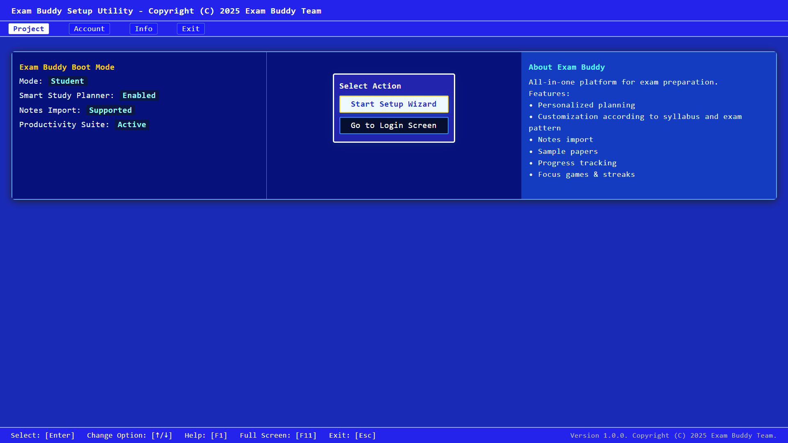 
  <em>Bootload screen – initializing the PrepIQ Windows 7–style environment.</em>

  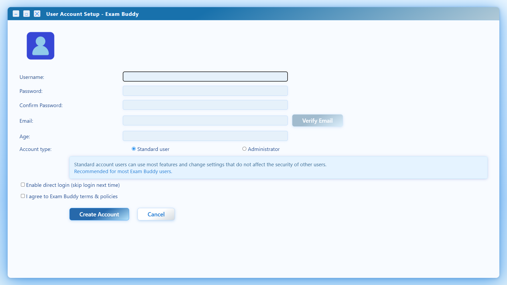 
  <em>Registration – onboarding new users into the PrepIQ ecosystem.</em>

  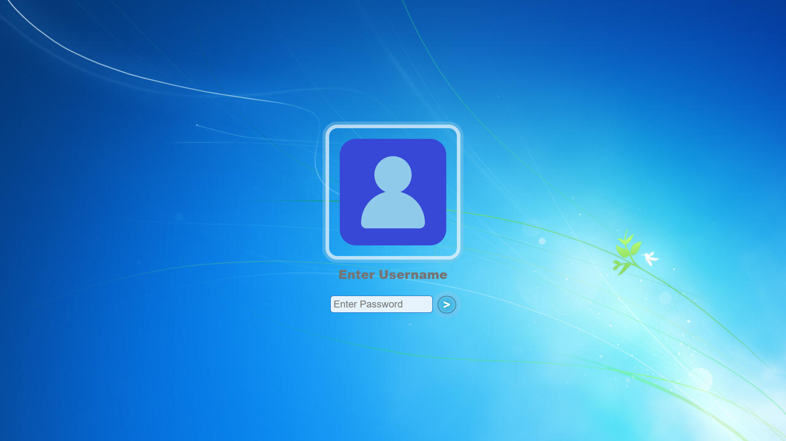 
  <em>Login screen – secure sign-in for students.</em>

  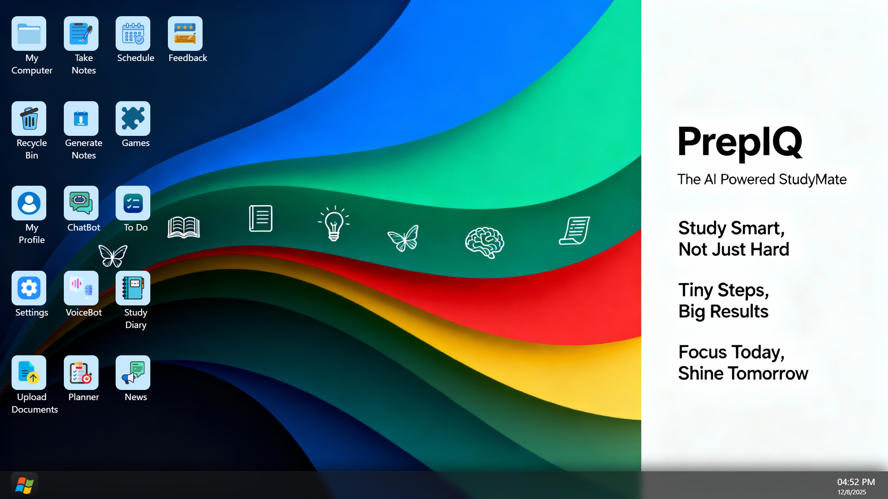 
  <em>Dashboard – Windows 7–inspired workspace with active apps and shortcuts.</em>

  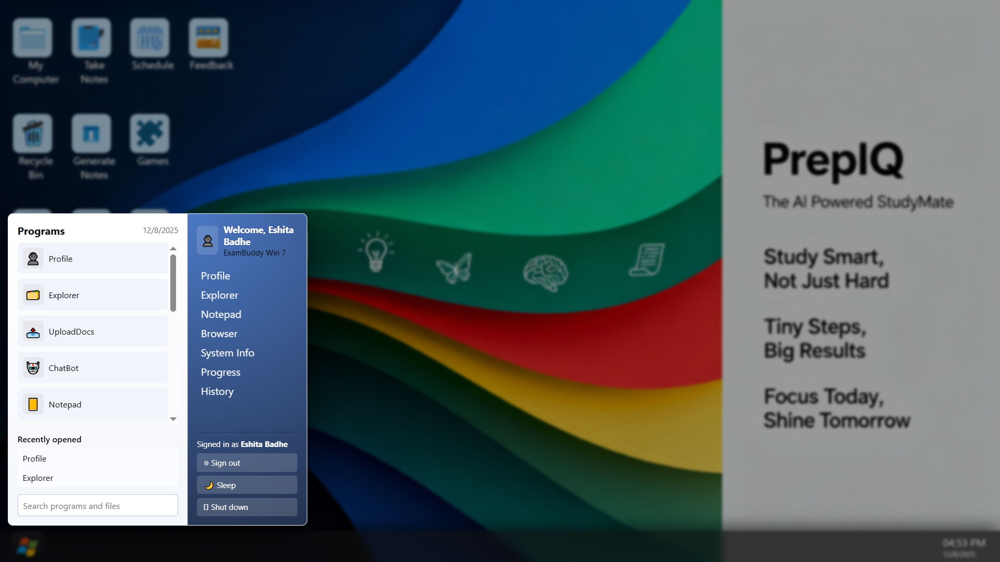 
  <em>Main menu – quick access to notes, quizzes, planner, and more.</em>

  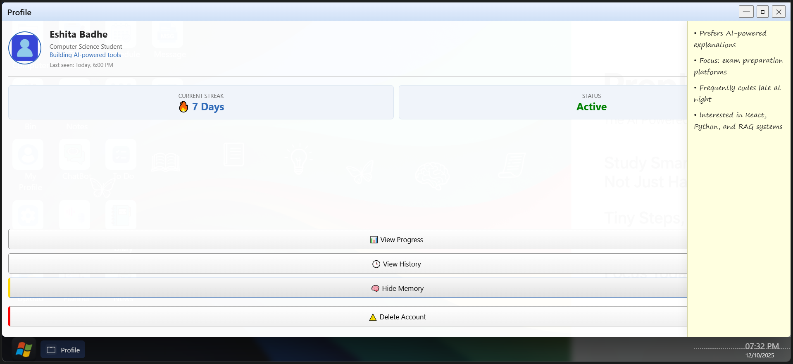 
  <em>Profile app – overview of streaks, status, context memory, and account controls.</em>

  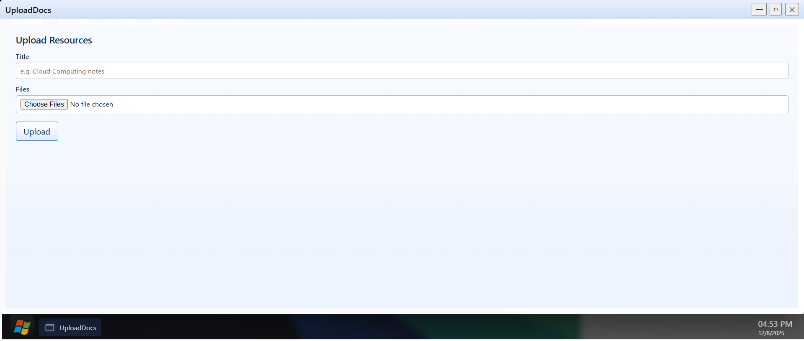 
  <em>Uploading – securely adding syllabus and notes for RAG processing.</em>

  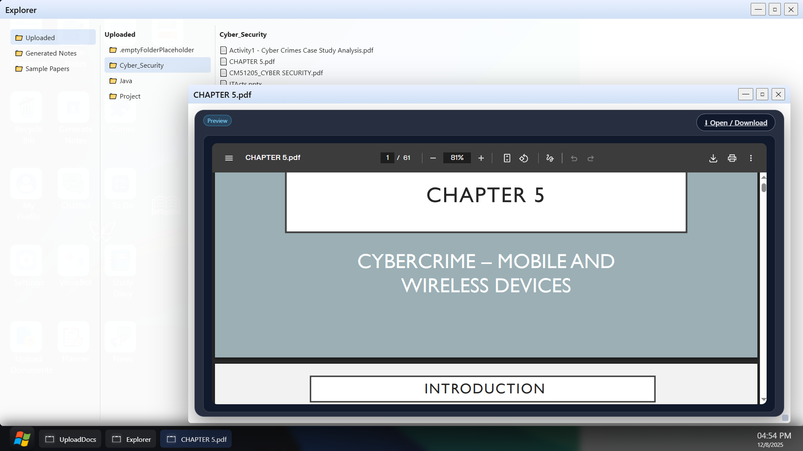 
  <em>File viewer – manage and review uploaded study materials.</em>

  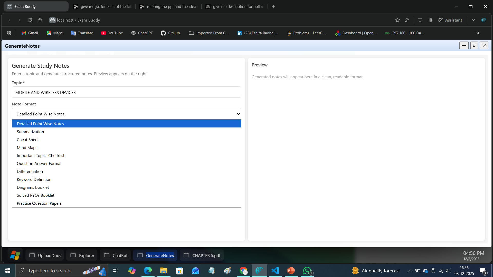 
  <em>Generate notes – choose topics and formats for custom notes.</em>

  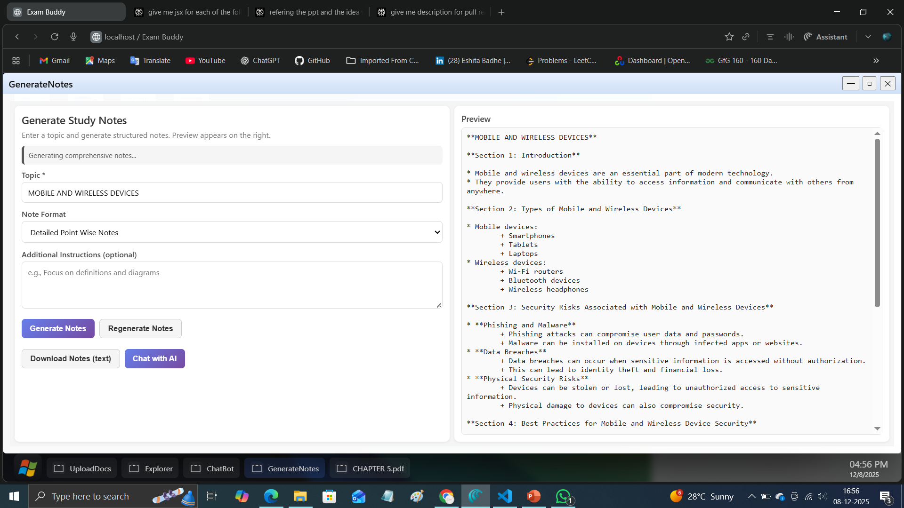 
  <em>Generated notes – AI-created, syllabus-aligned study material.</em>

  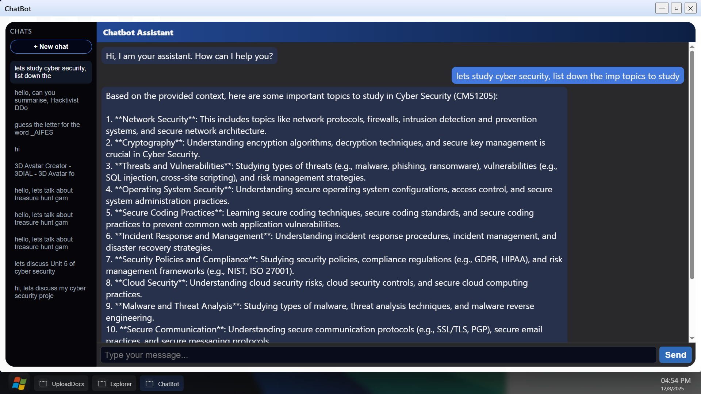 
  <em>Chatbot app – conversational assistant for instant doubt-solving and exam guidance.</em>

  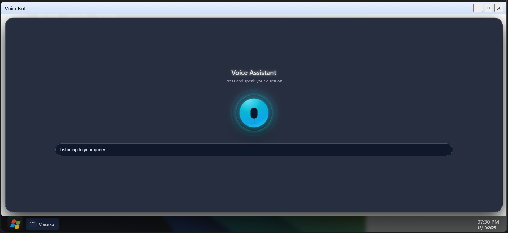 
  <em>Voice bot – hands-free queries with simple, clear explanations.</em>

  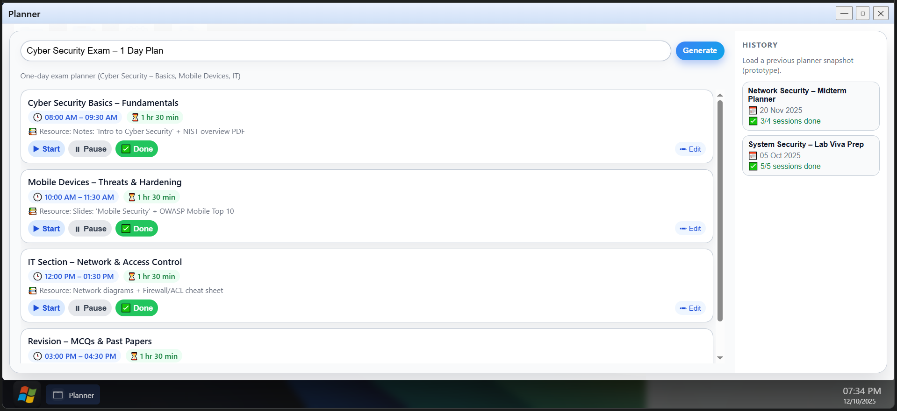 
  <em>Planner app – day-wise exam plan with timed study cards and completion states.</em>

  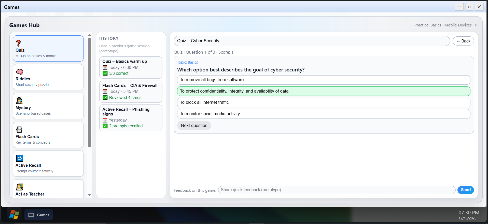 
  <em>Games app – quiz, riddles, flashcards and active recall modes with game history and chatbot launch.</em>

  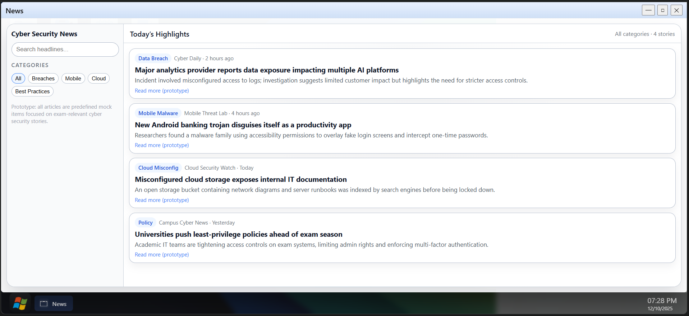 
  <em>News app – curated headlines in a clean card-based feed.</em>

  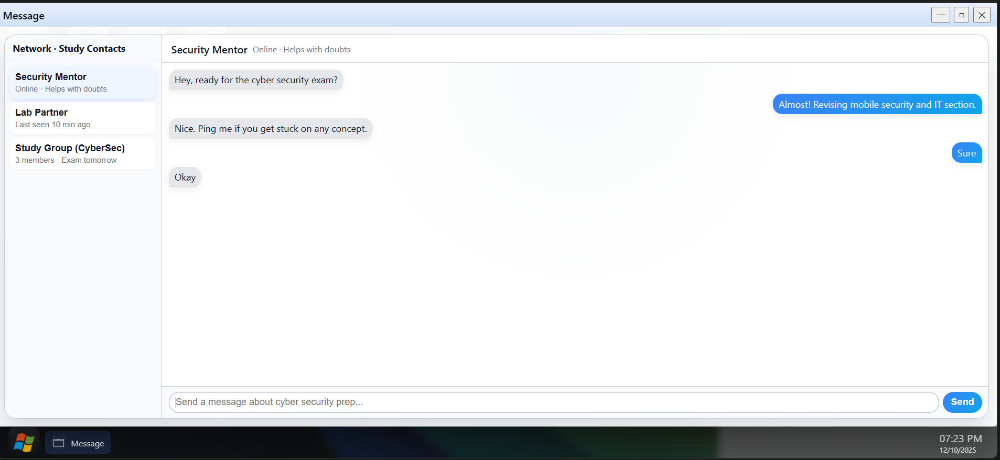 
  <em>Network app – messaging-style interface to chat with mentors and study groups.</em>

  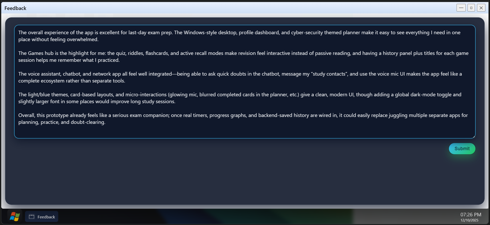 
  <em>Feedback app – lightweight form for students to share suggestions about PrepIQ.</em>

<h2>📌 Project Status</h2>
<ul>
  <li>This project is in its <strong>initial / prototype stage</strong></li>
  <li>Core flows (upload → RAG processing → content generation → planner and games) are being implemented and tested with real notes and sample syllabi.</li>
  <li>Interfaces, performance, and feature coverage are subject to rapid change as feedback from students is collected.</li>
</ul>

<h2>👥 Contributors / Team</h2>
<ul>
  <li><strong><a href="https://github.com/Eshita-Badhe">Eshita Gajanan Badhe</a></strong> – Full-stack development, architecture, AI integration (RAG, embeddings, LLM).</li>
  <li><strong><a href="https://github.com/Aarya-Chaudhari">Aarya Bhagwan Chaudhari</a></strong> – UI/UX, feature design, research, and front-end experience flows.</li>
</ul>

<h2>📂 Repository Structure</h2>
<pre><code>PrepIQ/
  |- backend/
        app.py, config.py
        rag_local.py, retrieval modules
        src/ (chunking, embeddings, ingest, multimodal 
        loader, RAG chain)
  |- src/
        |- apps/ 
            (Explorer, ChatBot, Notes, MindMaps, Planner, Games, VoiceBot, etc.) 
        |- assets/ 
            (icons, wallpapers)
        |- core UI files 
            (App.jsx, Login.jsx, Win7Desktop-Advanced.jsx)
  |- assets/ 
    (project screenshots)
  |- requirements.txt
  |- package.json
</code></pre>

<h2>🏁 Getting Started</h2>

  This section will be finalised after the first stable prototype.
  Planned:

<ul>
  <li>Prerequisites (Node, Python, Supabase project, local DB, and model setup).</li>
  <li>Environment configuration (<code>.env</code> for frontend and backend).</li>
  <li>Commands to run frontend and backend locally.</li>
</ul>
